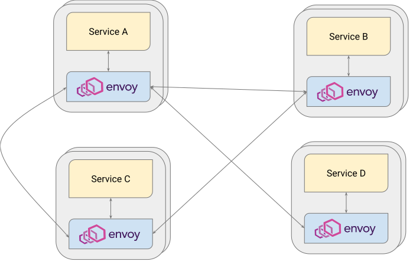
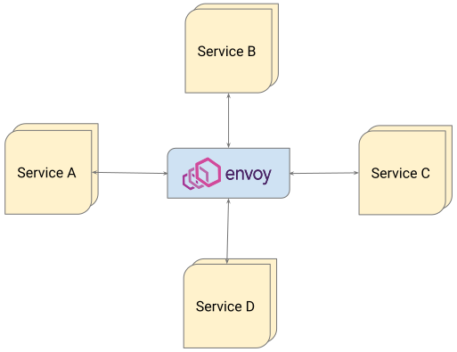
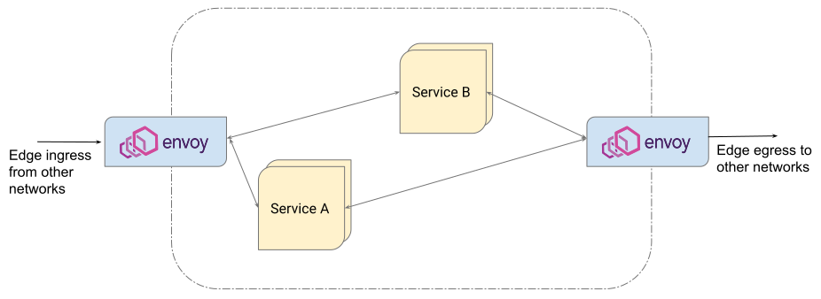
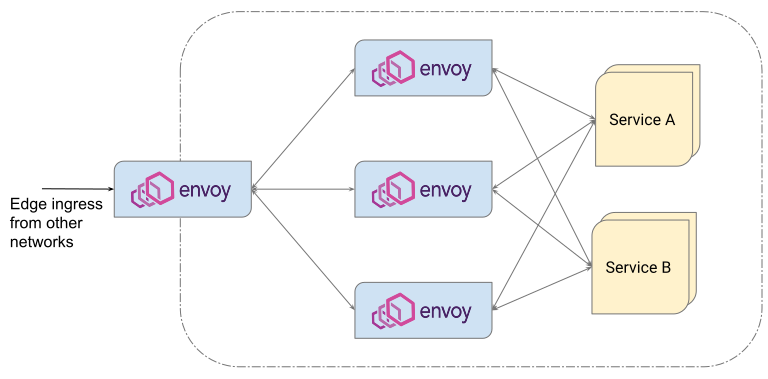
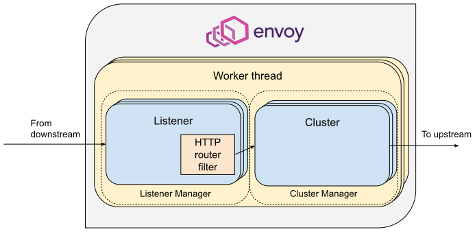

## Envoy?

Envoy는 대규모 현대 서비스 지향 아키텍처를 위해 설계된 L7 proxy 및 communication bus이다.  
Lift의 프로젝트로, Cloud Native Computing Foundation(CNCF)의 Graduated Project이다.   

이 프로젝트는 아래와 같은 목적으로 탄생했다.    
> 네트워크는 애플리케이션에 투명해야 한다. 네트워크 및 애플리케이션 문제가 발생하면 문제의 원인을 쉽게 파악할 수 있어야 한다.

msa의 단일 application과 service를 위해 설계된 **high performance C++ distributted proxy**으로,   
yaml로 policy를 작성하면 고성능의 proxy를 사용할 수 있다.

## why envoy?

우리가 gateway를 찾을 때 우리의 요구사항은 간단했다.  
기본적으로 gateway가 제공하는 인증/인가, end point의 역할을 하는 것.  
그리고 http/2와 grpc를 지원하는 것.  

envoy, kong, zuul, spring cloud gateway 같은 gateway들은 최근에는 모두 http/2, grpc를 지원하고 있다.  
그 중에 envoy를 선택한 이유는 **learning curve**가 비교적 낮기 때문이다.  
그리고 오픈소스이며 enterprise도 존재하지 않는다. (kong은 enterpirse 서비스가 존재)

envoy는 정책 기반으로 동작하는 proxy로 yaml 정책을 명시하기만 하면 proxy를 사용할 수 있다. 고성능으로.  
필요한 기능은 C++, Lua로 작성한 filter를 추가할 수 있다.   
대부분의 필요한 기능들은 이미 필터가 제공되고 있기도 하다.

envoy는 태생부터 service mesh를 위해 만들어진 서비스이다.   
k8s에서 service mesh로 사용하는 istio에서도 envoy를 사용하고 있기 때문에, 검증된 솔루션일 뿐만 아니라 envoy를 사용함으로써 추후에 istio를 더 쉽게 도입할 수 있다.  

## 기능

기능이야 많지만 대표적인 기능들만 추려보면.  

### Out of process architecture

Envoy proxy는 self contained process로 모든 언어와 application server와 함께 동작할 수 있게 설계되었다.  
envoy는 application과 투명하게 메세지를 주고 받으며 여러 application과 언어를 사용하는 현대 서비스 방향을 투명하게 만들어준다.  

그 자체로 메모리사용량이 적은 고성능의 서버이다.    
모든 프로그래밍 언어, 프레임워크와 함께 실행될 수 있다.   

즉 다양한 언어와 프레임워크를 사용하는 MSA 구조에 적합하고 유용하다.

### L3/L4 filter architecture

envoy는 L7 proxy 이지만 L3/L4 proxy에도 핵심 기능이 있다.  
[pluggable filter](https://www.envoyproxy.io/docs/envoy/latest/intro/arch_overview/listeners/listener_filters#arch-overview-network-filters)를 통해 TCP/UDP 관련 처리 등을 할 수 있다.  

### HTTP L7 filter Architecture

Http는 현대 application architecture에서 중요하고 [envoy는 이를 지원](https://www.envoyproxy.io/docs/envoy/latest/intro/arch_overview/http/http_filters)한다.  
buffering, rate limiting, routing/forwarding 등을 수행할 수 있다.

### HTTP L7 routing

path, authority, content type, runtime value 등에 따라 routing이나 redirectiong을 할 수 있는 routing을 지원한다.  

### protocol support
HTTP/2에 대해 투명한 지원을 한다. HTTP/1.1과 HTTP/2를 조합하여 사용할수도 있다.  
gRPC를 지원한다.  
현재 알파버전으로 HTTP/3도 지원하고 있다.

### Service discovery and dynamic configuration

계층화된 [dynamic configuration APIs](https://www.envoyproxy.io/docs/envoy/latest/intro/arch_overview/operations/dynamic_configuration#arch-overview-dynamic-config)를 사용한다.  
이 layer는 envoy에 backend cluster, routing 등에 대해 dynmic update를 제공한다.

### Advanced load balancing

[health check](https://www.envoyproxy.io/docs/envoy/latest/intro/arch_overview/upstream/health_checking#arch-overview-health-checking), [automatic retries](https://www.envoyproxy.io/docs/envoy/latest/intro/arch_overview/http/http_routing#arch-overview-http-routing-retry), [circuit breaking](https://www.envoyproxy.io/docs/envoy/latest/intro/arch_overview/upstream/circuit_breaking#arch-overview-circuit-break), [global rate limiting](https://www.envoyproxy.io/docs/envoy/latest/intro/arch_overview/other_features/global_rate_limiting#arch-overview-global-rate-limit) 등을 제공한다.  

## Network topology

| service mesh                | internal load balancer      | ingress/egress proxy on the network edge | multi-tier topologies       |
|-----------------------------|-----------------------------|------------------------------------------|-----------------------------|
|  |  |               |  |

envoy는 service mesh의 sidecar proxy로 시작되었지만 다양한 network topology에서 사용될 수 있다.  

## envoy architecture

envoy는 listner와 cluster라는 2개의 main part로 이루어져 있다.
- listener는 downstream request를 핸들링하고 lifecycle을 관리하는 책임이 있다.
- cluster는 endpoint에 대한 upstream connection을 선택하고 구성하는 책임이 있다.
- listner와 cluster는 HTTP router filter로 연결되어 있다.
- filter는 listener로부터 받은 요청을 filtering, 조작, 인증 등을 거쳐 cluster로 routing 하는 역할을 한다.

## reference

- https://www.envoyproxy.io/docs/envoy/latest/intro/what_is_envoy
- https://www.envoyproxy.io/docs/envoy/latest/intro/life_of_a_request