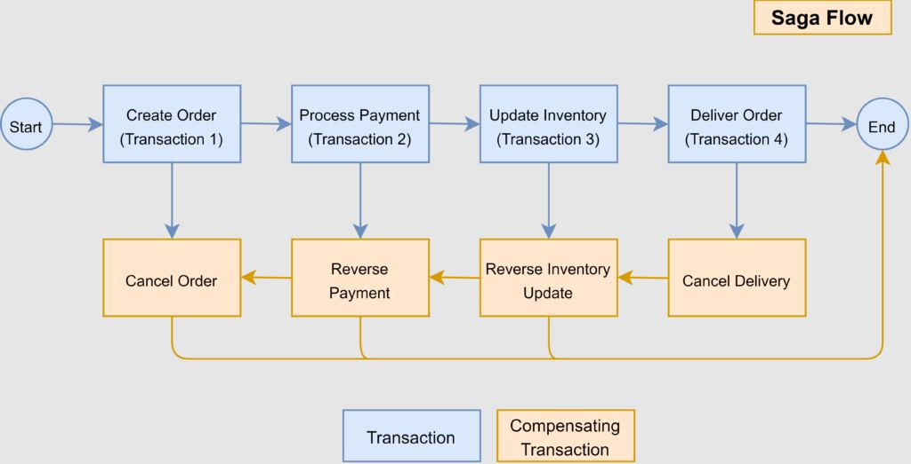

## saga 패턴이 필요한 이유

분산시스템(MSA)에서는 application을 여러 개의 작은 application으로 나누기 때문에 단일 요청이 여러 요청으로 세분화된다. (여러 개의 트랜잭션)  
이런 요청들은 일부는 성공하고 일부는 실패할 수 있다.  
이 경우 **모든 단계가 완료되거나 모든 단계가 완료되지 않아야 하는** 데이터 일관성을 유지하기 어렵다.

여러 트랜잭션의 경우 원자적 일관성을 유지할 수 없고, 궁극적 일관성을 유지하려고 하는데 그 방법 중 하나가 saga 패턴이다.

## saga 패턴의 해결 방식

트랜잭션의 모든 단계는 **보상 트랜잭션(compensating transaction)** 즉, **롤백**할 수 있다.  
그리고 실패가 발생하는 경우 진행된 트랜잭션에 보상 트랜잭션이 실행되어 완료된 작업을 취소할 수 있도록 한다.

## saga 패턴

그래서 saga 패턴은
- MSA에서 장기 트랜잭션 문제를 해결하는 것을 목표로 하는 필수적인 micro service 패턴이다.
- 트랜잭션에서 문제가 발생할 경우 롤백을 할 수 있게 설계한 패턴이다.

## saga 패턴 사용 예시

대표적인 saga 패턴 사용 예시는 전자 상거래.
전자 상거래 서비스의 경우 사용자가 상품을 주문했을 때 연속적으로 발생하는 작업들이 있다.
주문, 결재, 배송의 각각의 트랜잭션을 saga 패턴으로 관리할 수 있다.

만약 배송 트랜잭션에서 문제가 발생하면, 결제와 주문 트랜잭션을 롤백한다.

## 장점

- 여러 마이크로 서비스에서 복잡한 트랜잭션을 쉽게 구현할 수 있다.
- 오류를 적절하게 처리하고 데이터 일관성을 보장한다.
- 시스템 복원력과 견고성을 높인다.
- 데이터 불일치 및 업데이트 손실을 방지한다.
- 트랜잭션 보상을 위한 명확하게 정의된 프로세스를 제공한다.

## 단점

- 구현 및 유지 관리가 어렵고 모니터링 및 디버깅도 어렵다.
- saga의 상태를 저장하고 관리하는 오버헤드가 있다.
- 여러 마이크로 서비스에서 트랜잭션을 관리해야 하기 때문에 성능 오버헤드가 발생한다.
- 애플리케이션은 마이크로 서비스 간에 여러 번 왕복해야 하기 때문에 대기 시간이 증가한다.
- 서로 다른 마이크로 서비스에서 sagas를 구현하는 데 표준화가 없다. (java나 spring에도 없다)

---

DDD의 aggregate 간의 domain event를 통한 통신, MSA의 모듈간 통신에서 빼놓을 수 없는 패턴이 된 것 같다.

## reference

- [https://medium.com/javarevisited/what-is-saga-pattern-in-microservice-architecture-which-problem-does-it-solve-de45d7d01d2b](https://medium.com/javarevisited/what-is-saga-pattern-in-microservice-architecture-which-problem-does-it-solve-de45d7d01d2b)
- [https://www.baeldung.com/cs/saga-pattern-microservices](https://www.baeldung.com/cs/saga-pattern-microservices)