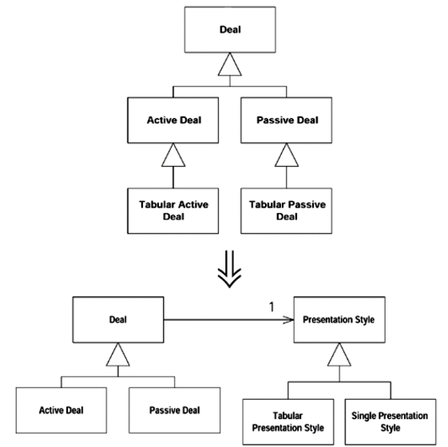
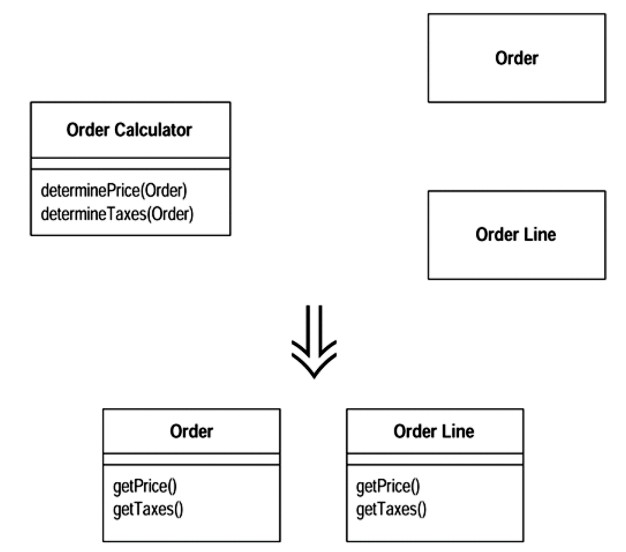

복합 리팩토링을 할때는 상황이 변화무쌍하다.  
가동중인 시스템을 대상으로 하는 리팩토링은 수 개월에서 수 년이 걸리기도 한다.  
서비스 중인 시스템을 작업 중단하고 리팩토링하겠다는 말을 받아주는 팀장은 없기 때문에.  

리팩토링은 시작했다고 끝을 봐야하는건 아니다.  
기능 추가나 버그 수정시에 시작해서 필요한 만큼만 하면 된다.  

어느정도 센스와 경력이 있는 개발자들은 리팩토링 냄새를 맡고 수정하는 일을 잘 하고 있다.  
실제 개발에서 리팩토링을 얼마나 잘하느냐는 복합 리팩토링을 어떻게 하느냐가 아닐까 싶다.

## 복햡 리팩토링은

개발팀 전원의 합의하에 실시해야한다.  
수정 방향이 많이 바뀌기 때문에 팀 전원이 복합리팩토링이 진행중임을 알고 움직여야한다.  
사공이 많아 배가 산으로 가지 않도록.  

## 복합 리팩토링 필요성

단순 리팩토링은 예측 가능하고 절차가 투명하고 만족을 즉시 얻는다는 장점이 있다.  
충분리 이해하지 못한 상태에서 결정된 설계가 쌓이면 막 자란 물풀로 막힌 운하처럼 프로그램이 막힌다.   
단편적인 이해로 결정된 설계는 프로그램에 악영향을 전파시킨다.  
이런 문제를 해결하고 예방하는게 복합 리팩토링.  

## 대표적인 복합 리팩토링

1. 상속 구조 정리 

하나의 상속 계층이 두 작업을 동시에 수행할 땐 상속 계층을 하나 더 만들어서 위임을 통해 다른 계층을 호출하자  

2. 절차 코드를 객체로 전환

코드가 절차식으로 작성되어 있을 땐 데이터 레코드를 객체로 바꾸고 기능을 쪼개서 각각의 객체로 옮기자

3. 메인 로직을 표현과 분리

도메인 로직이 들어있은 GUI 클래스가 있을 깬 도메인 로직을 별도의 도메인 클래스로 떼어내자

4. 계층구조 추출

한 클래스에 기능이 너무 많고 일부분에라도 조건문이 많을땐 각 조건에 해당하는 하위 클래스를 작성해서 계층구조를 만들자

## reference
 - 마틴 파울러, 리팩토링 12장