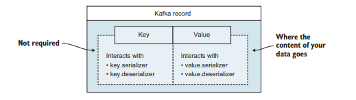
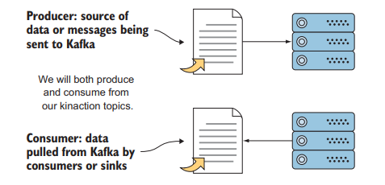
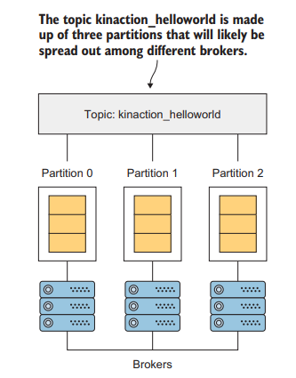
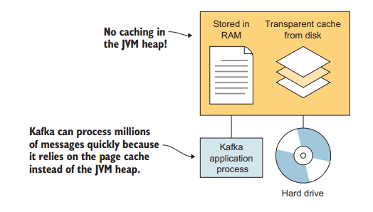
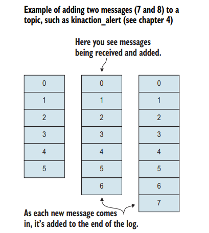
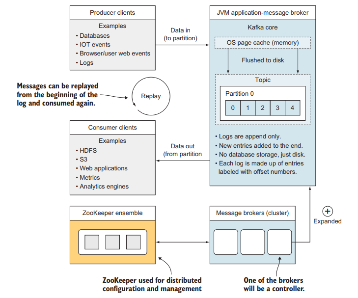

## 메시지 (message)

**레코드**라고도 부르는 **메시지**는 카프카를 통해 흐르는 데이터의 기본 요소이다.  
메시지는 **timestamp**, **value** 그리고 선택적으로 **key**를 갖는다.  
원한다면 **custom header**를 사용할 수도 있다.

key와 value는 각각의 serialize, deserialize를 위해 카프카 특유의 방식으로 상호작용할 수 있다.  
메시지가 있다면 브로커에게 메시지를 보내야 한다.

## 카프카 아키텍처

| 컴포넌트               | 역할                            |
|--------------------|-------------------------------|
| Producer           | 카프카로 메시지를 보낸다                 |
| Consumer           | 카프카에서 메시지를 조회한다               |
| Topics             | 메시지를 브로커에 저장하기 위한 논리적인 이름     |
| ZooKeeper ensemble | 클러스터에서 consensus를 유지하도록 돕는다   |
| Broker             | 커밋 로그를 처리한다 (메시지를 disk에 저장한다) |

## Producer & Consumer

**Producer**는 메시지를 카프카 topic으로 보내는 도구이다.  
default producer는 없으나 API, Flume, Connect, Streams 등이 사용될 수 있다.  

**Consumer**는 카프카에서 메시지를 검색하는 도구다.  
consumer는 topic을 구독하고 지속적으로 메시지를 polling 한다.

## Topic

Topic은 **Partition**이라는 단위로 구성된다.  
즉 1개 이상의 partition이 단일 Topic을 구성한다.  
카프카의 실제 작업은 대부분 disk에 실제로 구현되는 partition이다.  

partition replica 중 하나는 leader가 된다.  

예시
{: .label .label-yellow}  

파티션 3개로 된 토픽이 있고, 각 파티션은 3개의 replica를 갖고 있다.  
모든 파티션은 각각 **leader replica**를 선출했을 것이다.  
기본적으로 읽고 쓰기는 leader replica에서 발생하고 나머지 replica들은 follower가 되어 데이터를 업데이트 받는다.

## ZooKeeper

ZooKeeper는 discovery, configuration, synchronization service를 고가용성으로 제공하는 분산 저장소다.  
ZooKeeper는 카프카 생태계를 복잡하게 만드는 원인 중 하나다.  

참고사항
{: .label .label-green}  

카프카 요구사항을 단순화하기 위해 ZooKeeper 대신 자체 관리되는 Quorum으로 교체하자는 제안이 있고 kafka 3.대의 버전에서 Zookeeper 의존성에서 탈출했다.

Zookeeper를 사용하는 사례 중 하나는 앞서 봤던 leader replica가 어떤 파티션인지 합의하는데 사용하는 것이다.

## Page Cache

카프카는 수백만 개의 메시지를 빠르게 처리할 수 있는데, 이를 가능하게 만드는 핵심 중 하나는 <u>page cache</u>[^1]이다.  
broker가 JVM heap에 캐시되지 않도록 하여 <u>크기가 큰 heap으로 인해 발생하는 문제</u>[^2]를 방지한다.  

## Commit Log

Kafka에서 Commit Log는 Java의 logger의 로그나, DB의 WAL 처럼 숨겨진 세부정보가 아니다.  
오히려 kafka의 중심에 위치하며 사용자들은 offset을 사용해서 메시지가 로그의 어디에 위치하는지 찾을 수 있다.

Commit Log는 메시지가 항상 로그 마지막에 추가되는 추가 전용 로그이다.  
메시지를 읽을 때 그 메시지를 시스템에서 제거하거나 다른 consumer로부터 제외하지 않는다.  

                                              
## 카프카 상위 수준 뷰

상위 수준에서 정리한 카프카 뷰.

## reference

- Kafka In Action 2장

---

[^1]: 운영 체제에서 제공하는 메모리 기술 중 하나로, 디스크로부터 읽은 파일이나 블록들을 메모리에 캐시하여 빠르게 액세스할 수 있도록 하는 기술
[^2]: 장시간 또는 빈번한 GC로 인해 일시적인 멈춤([Stop The World](/docs/java/gc/basic#stw-stop-the-world))이 발생하는 문제