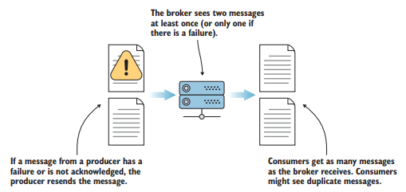
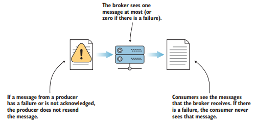
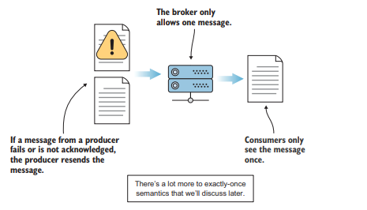

*More than 80% of all Fortune 100 companies trust, and use Kafka.* - Apache Software Foundation

카프카는 현재 어떤 산업의 분야에 관계 없이 대부분의 기업에서 사용되고 있다.  
카프카를 통해 데이터 플랫폼에 대한 표준이 바뀌고 있는데, 이전엔 <u>ETL과 batch workflow</u>[^1]로 처리하던 작업들이 카프카를 통해 **near-real-time** 데이터 처리로 가고 있다.  
카프카는 작업을 더 명확하고 간단하게 만들면서 [MSA](/docs/design/msa)와 IoT의 중심에 자리잡고 있다.

## 이벤트 스트리밍

카프카는 스스로를 이벤트 스트리밍 플랫폼이라고 소개하고 있다.  

이벤트 스트림이란 사람 몸의 중추 신경계 같은 것으로 이벤트 소스(DB, sensor, devices, cloud service, application)에서 이벤트 스트림 형태로 실시간으로 데이터를 캡처하는 방식이다.  
검색을 위해 이벤트 스트림을 영구 저장하고 실시간 이벤트 스트림을 조작하고 처리하는 것과 다른 곳으로 라우팅 하는 것도 포함한다.

## 카프카의 주요 특징

1. 메세지 큐처럼 레코드를 읽고 쓴다.
2. 내결함성(falut tolerance)로 이벤트 스트림을 지속적이고 안정적으로 저장한다.
3. 이벤트 스트림이 발생할 때 처리한다.

그 외에도 카프카의 여러 특징들이 있다.
- 카프카는 시스템으로 들어오고 시스템에서 나가는 데이터 중개인처럼 행동한다.  
- 프로듀서와 컨슈머 사이에 느슨한 결합을 생성한다.
- 데이터 병렬 처리가 가능하다.
- 다수의 컨슈머가 있을 수 있다.

## 카프카의 세가지 semantic

### 1. at-least once semantics

메세지가 수진 확인될 때까지 재발송된다.

같은 메세지를 한 번 이상 보내어 브로커에 틀림없이 기록되도록 한다.  
메시지가 브로커에 쓰였음을 보증받지 못한다면 프로듀서는 메세지를 다시 보낸다.  
중복 메세지를 컨슈머가 필터링해야할 수 있지만 가장 안전한 배달방식이다.

### 2. at-most once semantics

메세지는 단 한 번 보내며 실패하더라도 재발송하지 않는다.

메시지 전달이 실패하는 경우에도 프로듀서는 다음 메시지로 넘어가고 실패한 메시지를 다시 보내지 않는다.  
메시지를 잃어도 괜찮은 경우에 사용할 수 있다.  
수신 확인을 하는 것은 결국 시스템 자원을 소모하는 일이고, 메시지를 일부 잃어도 괜찮다면 성능과 비용을 위해 수신확인을 기다리지 않을 수 있다.

### 3. exactly-once semantics (EOS)

메시지는 컨슈머에게 단 한 번만 보인다.
- 한 번만 발송하는 것이 아니라 한 번만 보이는 것이다.

브로커가 하나의 메시지만을 허용하는 방식으로 프로듀서는 `at-least once semantics` 처럼 수신확인을 하나 컨슈머에게 도달하는 메시지는 하나가 된다.

## 카프카가 적절한 경우

1. 안정적인 message queue
   - kafka 초기의 사용 사례로 일반적인 사례
2. MSA의 [EDA](/docs/design/eda)에서의 이벤트 통신
3. IoT의 데이터 처리

## 카프카가 적절하지 않을 수 있는 경우

1. 실시간이 아니라 한 달이나 일 년에 한 번 데이터 처리가 필요한 경우
2. 메시지가 큰 경우
   - 카프카는 기본적으로 큰 메세지를 보내도록 설계되지 않았다.
   - 큰 메세지는 메모리 압박이 증가하고 캐시할 수 있는 메세지 수가 줄어 성능이 저하될 수 있다.

## reference

- https://kafka.apache.org/intro
- Kafka In Action 1장

---

[^1]: 배치 작업은 enterprise 급일수록 눈처럼 불어나 시스템이 과부하 상태로 빠질 수 있으며 관리를 위한 리소스가 필요하다.