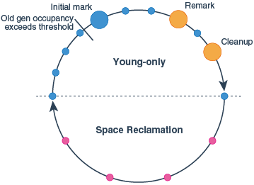

## G1

G1은 Garbage First 라는 이름으로 지어진 GC이다.
큰 memory를 갖는 multiprocessor machine을 타겟으로 높은 throughput과 작은 pause-time 목표로 만들어져서 현재는 java의 default GC이다.  

java 6에서 처음 선보이고 7에서 광범위하게 수정됐고 8u40 부터 안정된 GC가 되었다.  
- workload에 상관없이 8u40 이전 버전에선 G1을 쓰지 않는게 좋다.

G1 특징
- CMS 보다 훨씬 튜닝하기 쉽다.
- 조기 승격에 덜 취약하다.
- 대용량 heap에서 확장성(특히 중단시간)이 우수하다.
- full STW GC를 없애거나 확 줄일 수 있다.
- Java 9 부터 default GC
- 이전의 GC와 다르다.
    - generation 마다 경계가 명확한 memory가 없다.

### G1 heap

G1의 heap은 region으로 구성된다.  
region은 default 1MB인 memory 공간이고 heap이 커질수록 크기가 커진다. (세팅 가능)  
region을 이용해서 generation 별로 연속적인 메모리 공간을 갖지 않아도 되고 GC 수행마다 매번 전체 garbage를 collect 하지 않아도 된다.  


G1 에서는 1, 2, 4, 6, 8, 16, 32, 64MB 크기의 region을 사용할 수 있고, 기본적으로 heap에는 2048~4095 개의 region을 가질 수 있다.  
모든 region의 크기는 동일하고 JVM 실행 중에 크기가 변경되지 않는다.  

- region의 크기는 `heap size / 2048`에서 허용된 값으로 반올림하여 계산
- region 개수는 `heap size / region size`

### G1 알고리즘



young-only  
- object를 old generation으로 승격시키는 단계  
- old generation의 occupancy가 특정 임계점(Initial Heap Occupancy)을 넘을 때 young only에서 space reclamation 단계로 전환된다.  

initial mark 
- young GC와 동시에 marking을 시작한다.
- space reclamation 단계를 위해 old generation에서의 live object를 결정한다.
- marking이 끝나지 않더라도 young collection은 발생할 수 있다.
- marking은 remark와 cleanup으로 완료된다.

remark
- STW
- marking을 끝내는 단계
- global reference를 수행하고 class unloading 함
- remark와 cleanup에서 liveness information을 계산하고 내부 데이터 구조를 업데이트 하기 위해 사용되고 마무리 된다.

cleanup
- STW
- 완전히 비어있는 region을 정리하고 space-reclamation을 수행할지 결정한다.

space reclamation
- young과 old의 live object를 evacuate 하는 단계
- old region을 더 만힝 비워도 노력할만한 공간이 나오지 않는다고 판단될 때 종료


### Region Set

G1은 region 별로 GC 작업을 수행하므로 대규모 Java heap에 적합하다.  
Java heap이 크더라도 GC 작업의 양은 작은 Region set으로 제한되기 때문.  

G1에는 RSet(Remembered Set)라는 장치가 있음.  
region 별로 하나씩 외부에서 region 내부 region을 참조하는 레퍼런스를 관리하기 위한 장치.  
G1에서는 region 내부를 바라보는 레퍼런스를 찾기 위해 전체 heap을 뒤질 필요 없이 RSet만 보면 된다.  


### Humongous Objects

G1은 Region size의 50% 가 넘는 객체에 대해 연속되게 할당할 수 있는 region들을 찾는다.  
사용할 수 있는 연속된 region이 충분하지 않는 경우 full GC를 통해 heap을 compaction 한다.  
humongous object의 region은 old region 중 하나로 간주되고 하나의 object만 포함한다.  
full GC 중에도 움직이지 않는다.  
- region을 통채로 쓰니 당연한 것 같다.

사용하지 않을 경우 cleanup 단계나 full GC에서 수집될 수 있다.
- 예외적으로 java primitive type에 대한 array인 경우 어떤 gc 단계에서도 수집할 수 있다.

G1에서 humongous는 old gc에서 수집되니까 수명이 짧은 humongous는 참조되지 않는 시점을 훨씬 지나서 회수될 수 있는 문제가 있다.
- 경우에 따라 young GC에서 수집하는 방법이 구현됨
- 그러나 G1에선 잦은 houmongous 할당은 좋지 않음


### 다른 GC와 비교

- Parallel GC는 전체적으로만 Old Generation의 GC가 가능하다.
    - 반면 G1은 이 작업을 훨씬 더 짧게 여러번에 걸쳐 수행된다. 이렇게 하면 STW가 크게 줄어든다.
- CMS와 유사하게 G1은 Old Generation GC의 일부를 동시에 수행합니다.
    - 그렇지만 CMS는 Old generation heap을 조각 모음할 수 없으므로 결국 긴 Full GC가 필요하다.
- G1은 다른 수집기보다 높은 오버헤드가 있을 수 있고 동시 특성으로 인해 처리량에 영향이 있다.
- G1은 old generation의 비어있는 넓은 영역을 GC 할 수 있고, 이는 불필요한 GC 노력 없이 큰 공간을 확보할 수 있다.


### command

```
+XX:UseG1GC
```

G1의 주 목표는 중단 시간의 단축이고 GC 마다 application의 최대 중단 시간을 설정할 수 있다.  
그러나 이 값은 목표치이고 실제 이 기준에 맞춘다고 보장하진 못한다.  
100ms 이하는 현실성이 너무 떨어져 GC가 지키지 못할 가능성이 크다.

```
-XX:MaxGCPauseMillis=200 // 중단 시간을 200ms로 설정
```

1부터 64까지(MB)의 수로 region size를 변경할수도 있다.

```
-XX:G1HeapRegionSize=<n>
```

## reference

- https://docs.oracle.com/javase/9/gctuning/garbage-first-garbage-collector.htm#JSGCT-GUID-AC383806-7FA7-4698-8B92-4FD092B9F368
- https://www.informit.com/articles/article.aspx?p=2496621&seqNum=5
- Optimizing Java, chapter7