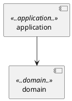

## 아키텍처를 보호하기 위한 테스트 ArchUnit

개발에 있어서 아키텍처의 중요성은 점점 커져가고 있다.  
최근 팀을 옮기고 개발하면서 불편한 점 중 하나는 아키텍처에 대한 이해도가 팀원들마다 다르다는 점이다.  

DDD와 hexagonal에 맞추어 잡아놓은 아키텍처가 다른 사람들의 작업으로 인해 무너지기도 한다.  
리뷰로 잡아야겠지만 휴가 중이거나 리뷰를 놓치는 경우도 있다.  

아키텍처가 문서화되고 준수되어야겠지만 이를 확인하고 강제하는 도구도 필요하다.  
아키텍처도 테스트로 강제화하는 방법을 소개한다.

## ArchUnit

ArchUnit은 아키텍처를 확인하기 위한 라이브러리.  
package, class, layer 간의 dependency 확인과 circular dependency 확인 등의 작업을 할 수 있다.

## 사용법

[archunit의 가이드](https://www.archunit.org/userguide/html/000_Index.html) 참고

## test 코드를 통한 architecture 제한 예시

```java
@AnalyzeClasses(packages = "com.meansoup")
public class HexagonalArchitectureTest {

    @Test
    @DisplayName("archunit 적용하기")
    void domain() {
        JavaClasses importedClasses = new ClassFileImporter().importPackages("com.meansoup");

        ArchRule archRule = noClasses().that().resideInAPackage("..domain..")
                .should().dependOnClassesThat().resideInAnyPackage("..adapter..", "..application..");

        archRule.check(importedClasses);
    }
}
```

## plantuml을 통한 architecture 제한 예시

plantuml에 component diagram을 그려놓고 archunit을 적용할 수 있다.  

```java
public class HexagonalArchitectureTest {
    
    @Test
    @DisplayName("plantuml로 archunit 적용하기")
    void byPlantUml() {
        JavaClasses importedClasses = new ClassFileImporter()
                .withImportOption(ImportOption.Predefined.DO_NOT_INCLUDE_TESTS)
                .importPackages("com.meansoup");

        ClassesShouldConjunction shouldConjunction = classes().should(
                adhereToPlantUmlDiagram("docs/01.architecture/component/architecture.puml",
                        consideringOnlyDependenciesInDiagram())
        );

        shouldConjunction.check(importedClasses);
    }
}
```

`withImportOption`을 적지 않으면 테스트에서도 적용되고, 이게 현재 작성한 fitness 테스트까지 검사해서 테스트가 실패한다.



위 테스트에서 사용한 예시 component diagram


## 실제 사용

초기 모듈을 개발하는 경우 개발 처음부터 설계된 package와 class에 맞춰 archunit 테스트를 작성하면 된다.  
개발되는 모든 사항이 테스트를 통과해서 아키텍처에 맞게 반영되는지 확인할 수 있다.  

그러나 이미 개발된 모듈이라면 패키지별로 테스트를 작성하고 수정하는 방식이 필요하다.  
나 같은 경우는 이미 개발된 모듈의 domain 패키지의 dependency를 제거하는 것을 첫 번째 테스트로 잡았다.  

### reference

- https://www.archunit.org/userguide/html/000_Index.html
- https://www.baeldung.com/java-archunit-intro
- https://d2.naver.com/helloworld/9222129